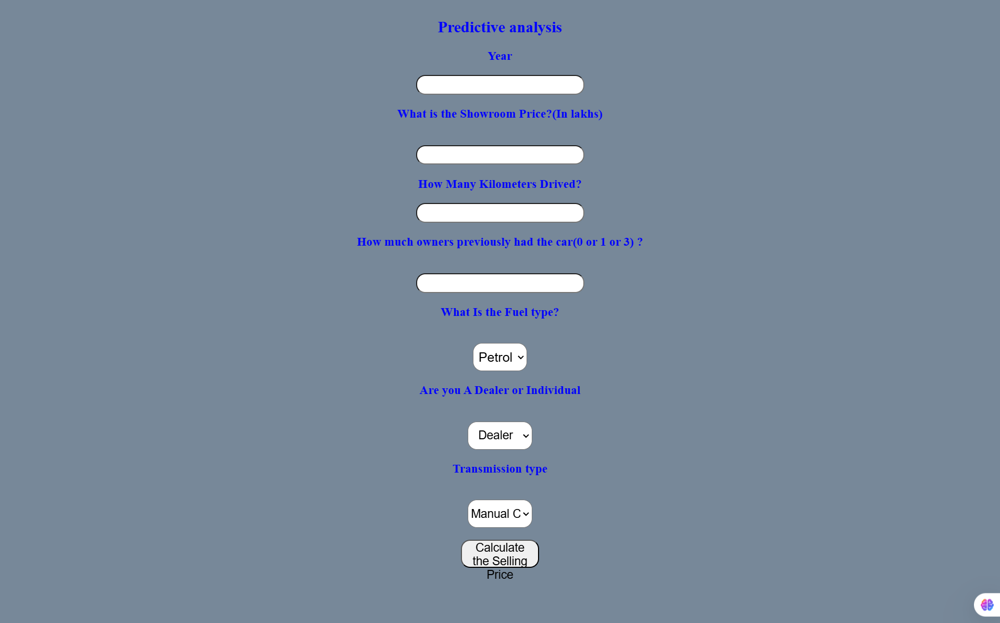

# 🚗 Vehicle Resale Value Estimator  

### Test Link
https://vehicle-valuation-model.onrender.com

### 📜 Overview  
The **Vehicle Resale Value Estimator** is a machine learning-powered web application designed to predict the resale value of vehicles based on user inputs. The application is built using **Flask** for the backend and **HTML** for the frontend, providing an intuitive and seamless user experience. It is deployed on **Render**, ensuring public accessibility and ease of use.  

This tool helps users estimate the market value of their vehicles by leveraging a trained predictive model, making it useful for buyers, sellers, and automotive businesses.  

---

### 🚀 Features  
✅ **Instant Valuation** – Enter vehicle details and get an estimated resale price in real-time.  
✅ **Optimized Model** – Uses a machine learning model trained for high accuracy.  
✅ **User-Friendly Interface** – Simple HTML-based form for easy data entry.  
✅ **Cloud Deployment** – Hosted on Render for seamless public access.  
✅ **Reliable Performance** – Model evaluation metrics ensure dependable predictions.  

---

### 🏗️ Technology Stack  
- **Frontend:** HTML, CSS  
- **Backend:** Flask (Python-based web framework)  
- **Machine Learning Framework:** Scikit-learn for model training and inference  
- **Deployment Platform:** Render  
- **Programming Languages:** Python (Backend & Model), HTML/CSS (Frontend)  

---

### 📊 Model Performance Metrics  
The trained model has been optimized to provide accurate vehicle valuation predictions, achieving:  

- **Mean Absolute Error (MAE):** 0.82  
- **Mean Squared Error (MSE):** 3.39  
- **Root Mean Squared Error (RMSE):** 1.84  

These metrics demonstrate the model’s reliability and effectiveness in predicting resale values.  

---

### 🏗️ Project Architecture  
📌 **Data Processing:** User inputs are preprocessed before being passed to the machine learning model.  
📌 **Model Prediction:** A trained regression model generates an estimated resale value.  
📌 **Web Interface:** A simple HTML-based form allows users to enter vehicle details.  
📌 **Deployment:** Flask serves the backend, and the app is hosted on Render for public access.  

---

### 📸 Interface Preview  
  

---

### ⚙️ Setup Instructions  

#### **Prerequisites**  
Ensure the following are installed on your system:  
🔹 Python 3.7+  
🔹 pip (Python package manager)  

#### **Installation Steps**  

1️⃣ **Clone the Repository:**  
```bash
git clone https://github.com/nakkkul/resale-value-prediction.git
cd resale-value-prediction
```  

2️⃣ **Install Dependencies:**  
```bash
pip install -r requirements.txt
```  

3️⃣ **Run the Application Locally:**  
```bash
python app.py
```  

4️⃣ **Access the Application:**  
Open [http://localhost:5000](http://localhost:5000) in your browser to use the app.  

---

### 🌐 Deployment Link  
You can access the live version of the application here:  
🔗 [Vehicle Resale Value Estimator](https://resale-value-prediction.onrender.com)  

---

### 📚 Future Enhancements  
🔹 Expand the training dataset to improve model accuracy.  
🔹 Add a feature for multi-vehicle comparisons.  
🔹 Implement an API for integration with other platforms.  

---

### 🤝 Acknowledgments  
A special thanks to open-source machine learning frameworks and datasets that made this project possible.  
